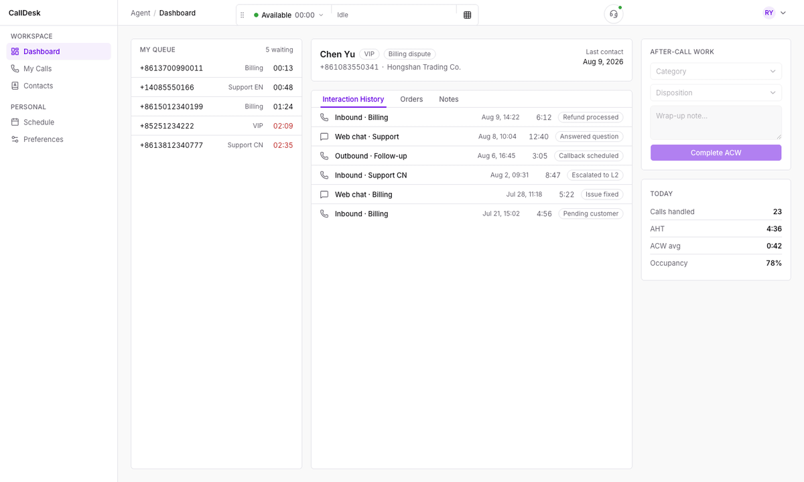

# AI Native Call Center

开源呼叫中心：AI 是默认接听者，而不是附加功能。

来电由 FreeSWITCH 接入，再由语音模型通过端到端的语音对话直接应答——这条语音链路
由应用自己终结。模型负责说话，流程负责阶段控制，并决定什么时候需要真人。需要的时
候，来电被转入真正的队列，坐席在浏览器前等着接，他们的 SIP 链路由一个配套的
Chrome 扩展持有。两条路径做过的事，最后落成同一份通话记录。

整个产品是**一个 Go 可执行文件**——REST API、事件流和全部 Web 界面都在里面——外加
PostgreSQL 和 FreeSWITCH。

[English](README.md) · [部署](deploy/README.md) ·
[设计文档](docs/design/00-overview.md)

<!-- 录自坐席工作台原型（ui-test / CallDesk）：接听来电、实时转写逐行出现、话后处理。 -->


## 先跑起来

```sh
git clone https://github.com/rasonyang/ai-native-callcenter
cd ai-native-callcenter/deploy
cp .env.example .env    # 只需填两行：FS_EXTERNAL_IP 和 ALIYUN_API_KEY
docker compose up -d
```

首次启动会从这份代码构建应用，需要几分钟；之后再启动只需几秒。

打开 `http://<主机地址>:8080`，用 `admin` / `aicc@123` 登录。数据库、交换机和应用会
一起启动，并预置一支坐席团队、两个队列、六条已发布的双语流程（每条一个英文号码、一
个中文号码和一个美国号码，总机是 800-555-0199）、十八部模拟客户电话，以及一周的历史
数据，这样看板不会是空的，软电话也能立刻打给机器人。所有密码都是 `aicc@123`。
[更多说明](deploy/README.md)

## 它做什么

**用模型应答，而不是按键菜单。** AI 分支是应用内部的一个 SIP 端点：FreeSWITCH 把
来电桥接过来，音频直接送往语音模型——只要对方接受，G.711 就原样透传，中间不做任何
解码和重采样。

**只控阶段，不写死对话。** 对话由模型主导，阶段由流程主导。每个阶段带一段指令和一
份允许调用的工具清单，转移条件基于工具返回结果触发。阶段还可以带一句自己的话——开
场白、转人工的交代、结束语——机器人应当照原文说出，而不是改写：`doubao` 直接把这句
话交给引擎播报，另外四个厂商则被要求一字不差地复述。内置工具**可以拒绝**——"队列
已关闭"是一句需要说给用户听的话，而不是一个错误。人设、规则和机器人的音色一起版本
化并发布。

**转人工要转得像样。** 转接进入 `mod_callcenter` 队列，坐席的电话响起时，屏幕弹屏
已经到位：SSE 上的 `PARTY_RINGING` 事件说明是谁打进来，并带上这通电话的
`userData`；机器人阶段的对话文本也已经可以直接读，因为通话 ID 在任何一条分支出现之
前就已生成，并在转接之后继续沿用。坐席在浏览器里工作：状态管理、通话控制条、回呼队
列——唯独音频不归本应用，它属于另一个仓库里的
[web-sip-phone](https://github.com/rasonyang/web-sip-phone) Chrome 扩展。该扩展
持有坐席的 SIP 注册，用本应用在登录时下发的凭据完成注册，而且它自己没有拨号盘：接
听、保持、挂断都是这边的 REST 调用，再经 ESL `uuid_phone_event` 送到话机。主管有实
时看板、队列视图和坐席花名册。

**一通对话只有一条记录。** 机器人接听、转入队列、坐席结束的一通电话，是**一条**
CDR、一份对话文本、一个录音文件，而不是三段碎片。录音存本地文件系统，或任意兼容
S3 的对象存储。

**中英双语，并且明确告诉你在用哪个厂商。** 界面和机器人都支持中英文。一套部署只用
一个语音厂商，启动时选定：中国大陆用 `qwen` 或 `doubao`，其他地区用 `openai` 或
`gemini`，也可以用 `gateway` 指向自建的 Realtime 网关。**通话的语言永远不会用来选
择厂商。** 其中三个是同一套协议的不同 profile；`doubao` 和 `gemini` 各自走另一套协
议，各有自己的客户端（见[如何接入一个语音厂商](docs/provider-extension.md)）。

## 结构

```
                    ┌─────────── 一个 Go 可执行文件 ───────────┐
  来电 ──▶ FreeSWITCH ──▶ SIP UAS ──▶ 语音厂商（Realtime 实时语音）
                 │           │
                 │           └─ 流程引擎：阶段、工具、转接
                 │
                 ├─ mod_callcenter 队列 ──▶ 坐席（浏览器 + web-sip-phone）
                 │
                 └─ ESL ──▶ 通话注册表 ──▶ REST + SSE ──▶ Web 界面
                                                 │
                                            PostgreSQL
```

FreeSWITCH 的用户目录和 `mod_callcenter` 队列**都从数据库读取**，经由 Lua 提供。
拨号方案是静态 XML，但它的规则自己不做判断：每条规则都把通话交给 Lua 脚本，由脚本
去数据库里查。新增分机、队列或号码是一次数据库变更；交换机自己的配置文件只有在路由
本身变化时才需要改。

读代码之前值得先知道两点：

* 领域模型沿用 Genesys 谱系：一通 **call** 聚合多个 **party**；分支事件是
  `PARTY_*`，整通电话级别的事件是 `CALL_*`。
* 每通在线通话都是一个 actor——单一 goroutine 作为唯一写入者，快照通过信箱获取。
  `internal/telephony` 里没有任何锁保护通话状态，因为根本没有共享的通话状态；AI 分
  支是例外，它用互斥锁守护自己几个 goroutine 共享的播放与记录状态。

完整设计见 [`docs/design/`](docs/design/)，从
[总览](docs/design/00-overview.md) 开始。

## 从源码构建

```sh
make dev-up            # 用 Docker 起 PostgreSQL
cd web && npm install && npm run build && cd ..
make build             # 产出 bin/aicc，界面已嵌入
./bin/aicc useradd -username admin -password '…' -role ADMIN
./bin/aicc
```

做前端时用 `make web-dev`，Vite 跑在 5173，API 在 8080。

```sh
go test -race ./...    # 一律带 -race，它在这个项目里抓到过真实的 bug
make lint              # go vet、gofmt、oxlint
make api-check         # API 契约校验
```

HTTP API 是**契约先行**的：[`docs/openapi.json`](docs/openapi.json) 是唯一事实来
源，Go 服务端和 TypeScript 客户端都由它生成。先改契约，再跑 `make api-generate`，
然后写实现，顺序不能反。

## 扩展

* **新增语音厂商**加的是一个 profile，而不是一个新客户端：
  [`docs/provider-extension.md`](docs/provider-extension.md)。
* **新增流程**是一份加载时校验的 JSON，可参考
  [`internal/seed/flows/`](internal/seed/flows/) 里那条双语流程。
* **新增页面**遵循 [`web/CLAUDE.md`](web/CLAUDE.md) 里的设计系统——那是硬性约束，
  不是建议。
* **对接其他产品**是一个部署在流程后端地址之后的独立服务，不进入本仓库：
  [`CONTRIBUTING.md`](CONTRIBUTING.md#integrations-live-outside-the-tree)。

## 当前状态

人工路径、AI 路径、产品界面和打包都已完成，并在真实 FreeSWITCH 与真实厂商上验证
过。

性能目前**还不是**本项目对外给出的承诺。设计里有容量预算和延迟目标
（[设计 06](docs/design/06-capacity.md)），压测所需的工具也已经在仓库里
（[docs/load-tests.md](docs/load-tests.md)），但正式的压测 benchmark 还没有做——所
以那份预算目前只是目标，不是实测结论。

有一件事是**明确不做**的：在本进程内做 ASR + LLM + TTS 的级联流水线。那种组合应当
是一个独立服务，说同一套协议。

## 许可证

Apache-2.0，见 [LICENSE](LICENSE)。
